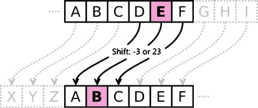

# double-decryptable-ciphers
Program that looks for English words that decrypt/encrypt to other English words. Open in an IDE.

# Goal
The goal of this program is to find english words that encrypt/decrypt to other english words. Reading some stuff about cryptography I though it would be cool to see if there were any words that when a caesar cipher is applied to them encrypt to another word instead of just gibberish. (A caesar cipher is the kind of cipher that shifts the letters in a message to another letter in the alphabet based on a shift value.)

# What
There are some text files and code. The text file named "results.txt" is the final output of the program. It holds all the special english words that encrypt/decrypt to other english words. If you want to see the double decryptable words the program found then look in there. The text file "word_list.txt" is a database of all the english words that were tested. (In total 370,100 words) (btw the last word in the database is "zwitterionic" which is defined as "a mostly nuetral ion possessing both positive and negative electrical charges.") Also "usable.txt" is some special words from "results.txt" I've collected that are the most usable for making full messages/sentences with. 

# How
The load function on line 36 of "Main.java" goes through all words in "word_list.txt" (the word database) and decrypts/encrypts them with shifts 1-25, basically brute-force checking to see if any word decrypts/encrypts to any other word. If so write down that word in "results.txt."

# Example
Basically finding words that can make a sentence like:

 

'_bin bug, hi won_'

 

...which looks like a normal sentence with normal words, but it holds a secret message.
When decrypted with a shift of 20 it yields:

 

'_hot ham, no cut_'

 

The original sentence didn't look like it was an encrypted message hiding a secret but it was. It's kind of like hiding in plain sight. Hiding the secret message in a seemingly normal, unencrypted sentence. 

 

There are also twice-decryptable messages like:

 

'_vch voa, bc qih_'

 

Which first decrypts to reveal:

 

'_bin bug, hi won_'

 

Which doesn't really make any sense. In reality you must decrypt the sentence once more in order to reach the final secret message! Which once again is:

 

'_hot ham, no cut_'

 

That's all really. This isn't really useful for much I don't think but it's pretty neat. Thank you for reading.
*Please contact for questions or feedback: [maxcontact5@keemail.me](mailto:maxcontact5@keemail.me)*
